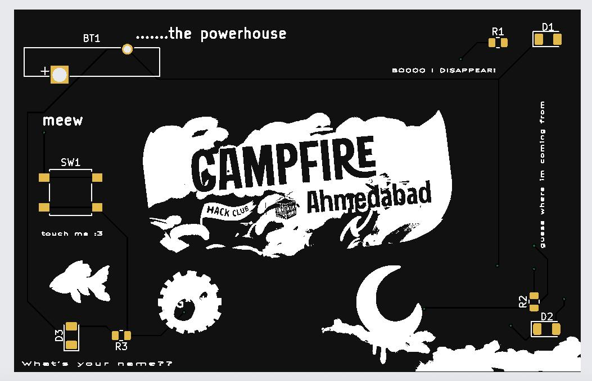
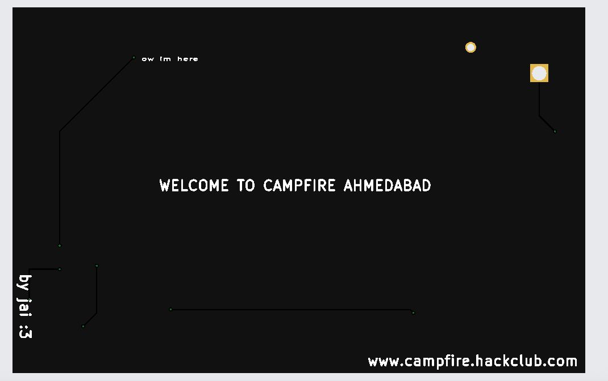

# Camp-Card 🎟️

**Camp-Card** is a custom-designed PCB card created for **Campfire Ahmedabad**, a beginner-friendly 24-hour problem-solving and game jam for high school students. The card is designed as a physical keepsake and technical showcase, representing creativity, electronics, and maker culture.

## 📸 Preview

### Front

### Back

> *(Images show the front and back silkscreen/layout of the Camp-Card PCB.)*

---

## 🧩 PCB Specifications

* **Layers:** 2
* **Dimensions:** 85 mm × 54.5 mm (card-sized)
* **Base Material:** FR-4 (TG135)
* **Thickness:** 1.6 mm
* **Copper Weight:** 1 oz
* **Surface Finish:** HASL (with lead)
* **PCB Color:** Black
* **Silkscreen:** White
* **Via Covering:** Tented
* **Quality Standard:** IPC Class 2
* **Electrical Test:** Flying Probe Test

---

## 🛠️ Design & Manufacturing

* Designed using **EasyEDA**
* Manufactured via **JLCPCB**
* Intended for **industrial / consumer electronics** use
* Produced in a batch of **150 units**

---

## 🎯 Purpose

Camp-Card serves as:

* A **physical souvenir** for participants
* A **conversation starter** about PCBs and hardware
* An **introduction to electronics manufacturing** for students
* A symbol of the Campfire Ahmedabad maker community

---

## 📍 About Campfire Ahmedabad

Campfire Ahmedabad is part of **Hack Club**, a global nonprofit community empowering teenagers to learn by building. The event brings together students to collaborate, create, and explore technology in a fun, inclusive environment.

---

## 📜 License

This project is shared for educational and non-commercial purposes.
